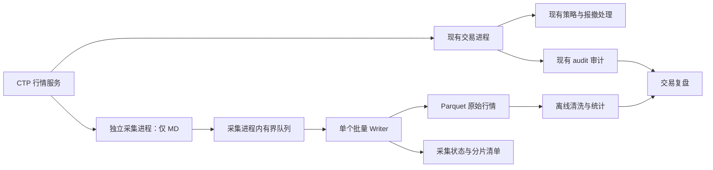

# 独立 CTP 行情录制方案

日期：2026-09-13。状态：已获用户授权实施；独立采集器及 7x24 短时只读验收已完成，详见 [VERIFICATION.md](VERIFICATION.md)。下文保留原设计与长期验收边界。

目标：持续保存收到的原始行情，供以后统计、清洗与回放；新增录制功能不进入现有行情挂单、撤单、成交和收口调用链。

## 1. 结论与约束

采用独立 Python 行情采集进程，单独建立 MD 行情连接，在采集进程内部使用有界队列与一个批量写入线程，将数据保存为 Parquet。第一版不接交易控制台，不改策略配置结构，不把录制健康状态接到交易状态机。

本机双进程可以隔离 Python 锁、事件循环、异常及退出流程，但不能保证 CPU、内存、磁盘和网络完全没有竞争。若并行压测不达标，将相同采集程序部署到另一台机器，并单独确认账户连接许可；不以降低交易安全门槛解决录制问题。

第一版优先订阅当前关心的合约，可只读提取策略文件中的合约身份；不自动订阅全部市场。独立采集可以早于策略启动，并在策略结束后继续运行。

## 2. 已核对的项目依据

| 当前源码 | 已验证的事实 | 设计影响 |
| --- | --- | --- |
| `vendor/vnpy_ctp/vnpy_ctp/api/vnctp/vnctpmd/vnctpmd.cpp:196,525` | 原生回调先进入 C++ task queue，再取得 GIL 转成 Python dict；含原始日期、成交量额、五档与 BandingUpperPrice/BandingLowerPrice | 直接在采集器自己的 MdApi Python 回调复制 dict，保留包装层实际给出的全部行情字段 |
| `vendor/vnpy_ctp/vnpy_ctp/gateway/ctp_gateway.py:320` | 当前网关会过滤缺时间戳/缺合约元数据的推送、调整价格、生成日期，再发 TickData | 完整 RAW 不从这个标准化后的对象倒推 |
| `live_grid/ctp_adapter.py:228` | 策略 TickEvent 提取最新价、买卖一价格、日期与限价等字段，未保留完整成交量额和盘口数量 | 现有审计不能替代完整原始行情库 |
| `live_grid/ctp_adapter.py:637`、`live_grid/audit.py:70` | 持同一个 RLock 调用 session.handle、同步写入并 flush 审计，再 dispatch 动作 | 不扩展此处的数据写入责任；本次保留现有审计机制 |
| 本地安装的 `vnpy/event/engine.py:66` | 同一个事件工作线程依次调用处理器 | 注册额外文件写入处理器会占用同一处理线程 |
| `vendor/vnpy_ctp/vnpy_ctp/gateway/ctp_gateway.py:165,174` | CtpGateway 创建 TD 和 MD，并在 connect 中连接两者 | 采集器不用完整 CtpGateway.connect，也不直接把 run.py 当作仅行情入口 |
| `live_grid/ctp_native.py:77` | 环境激活通过临时文件替换共享原生库，已加载检查仅针对当前进程 | 新进程本身不足以隔离库切换；需要独立的原生运行目录 |
| `requirements.txt` | 当前声明 vnpy 和项目内 vnpy_ctp，未声明 pyarrow | 录制依赖单独安装，不升级当前交易虚拟环境 |

上述结论基于当前工作区，含已有未提交修改，不依赖旧版代码状态。

## 3. 进程关系



两进程之间不传 Tick，不共享队列或锁，不由交易进程启动、等待或关闭 Writer。采集器故障只改变采集器状态，不发送交易进程信号，不修改停止标记或交易审计。

独立连接收到的行情与交易连接可能有不同的到达时间、条数和顺序。录制数据用于市场研究；精确说明策略为何挂单、撤单、平仓仍以该交易 run 的审计为准。以后如果明确要求逐条重放策略所见原始 Tick，需要另行评审交易连接的轻量旁路，不能把本方案称为已经覆盖该能力。

## 4. 采集入口与运行隔离

1. 增加 `run_market_recorder.py`，只实例化项目绑定提供的 MdApi，不实例化或连接 TdApi，不建立 MainEngine，不调用交易查询、报单、撤单接口。包初始化可能导入 TD 扩展，这不等于建立 TD 会话，测试应检查对象创建和连接行为。
2. 凭证仍来自 `.env` 的既有环境映射；只加载 MD 所需值，不打印凭证、完整连接配置或登录回报。采集配置仅包含环境别名、合约身份、输出位置、队列及写入限额。
3. 为每个采集 run 建立独立 CTP flow 目录；不复用 `.vntrader/ctp`。CTP 原生 flow 文件不属于可分享的数据成果，不承诺其内部无敏感内容，使用受限权限并与行情成果分开。
4. 采集专用虚拟环境与匹配环境的原生运行副本，在采集启动前准备。副本从项目管理的 vendor 版本生成，保留版本与哈希；`--check` 只读验证，运行阶段不调用现有共享库激活函数、不写当前交易环境的 framework。必须验证扩展实际加载路径，而非仅有目录副本。
5. 首先在没有挂单的窗口验证当前账户和前置是否允许额外 MD 会话，且不会踢掉既有 MD/TD 连接。此事实尚未验证，不默认并发连接一定被允许。若不允许，暂停此环境采集，申请独立行情会话/凭证或重新评审接入方式。
6. 合约订阅以逐合约确认回报为准；登录成功不等于全部订阅成功。记录连接代次 `connection_id`，重连退避，确认登录后重订阅，并标记断开区间。

## 5. 数据保存契约

RAW 的定义是“项目 CTP 包装层交付到采集器 Python 回调的行情字段”，不是网络原始报文，也不是交易所逐笔委托/逐笔成交。保留异常和重复观察，不在写入前按相同时间戳去重。

| 数据组 | 第一版保存内容 |
| --- | --- |
| 来源与身份 | schema_version、source_id（区分 first/7x24/guangfa）、run_id、connection_id、seq_no；合约身份保留大小写 |
| 原始时间 | TradingDay、ActionDay、UpdateTime、UpdateMillisec，原样保留 |
| 本地时间 | recv_epoch_ns、recv_monotonic_ns，定义为 Python 行情回调入口的时刻，不冒称网卡或 C++ 回调接收时刻 |
| 合约原字段 | InstrumentID、ExchangeID、ExchangeInstID、包装层 reserve 字段 |
| 成交与统计 | LastPrice、Volume、Turnover、OpenInterest、前结算/前收盘/前持仓、开高低收、结算价、均价、PreDelta/CurrDelta |
| 价格边界 | UpperLimitPrice、LowerLimitPrice、BandingUpperPrice、BandingLowerPrice |
| 盘口 | BidPrice1–5、BidVolume1–5、AskPrice1–5、AskVolume1–5，保存实际返回值；不把五档字段存在解释为拥有有效五档行情 |
| 来源元数据 | 采集器版本、Python/绑定/原生库版本及哈希、无凭证订阅列表、主机时区与启动时间 |

采用显式 Arrow schema：本地序号/纳秒时钟/累计成交量及盘口量为 int64；毫秒为 int32，避免异常值因过窄类型整批失败；价格和金额为 float64；原始日期/身份为 string。未知新增字段不得静默丢弃：记录 schema 不匹配，隔离该批并停止继续宣称录制健康，更新 schema 后恢复。

RAW 保留无效浮点哨兵和原始零值；清洗层生成 NULL 与质量标记，不覆盖 RAW。按实际 SDK 字段契约处理无效值，避免对所有价格使用随意的量级阈值。若出现类型不符等无法写入情况，保留可写的隔离样本与错误，磁盘不可写时只保证上报错误，不能承诺隔离样本落盘成功。

`seq_no` 在 Python 回调入口、入队之前递增；唯一键为 `(source_id, run_id, seq_no)`，表示本次采集的本地顺序。它不是交易所序列号，连续也不能证明上游没有丢数据。重启更换 run_id；进程内重连保留 seq_no 并增加 connection_id。

统一行情时间 `event_epoch_ms` 在离线清洗层生成：显式 Asia/Shanghai；校验日期、时分秒及毫秒 0–999；结合来源、交易所和夜盘规则标注可信度。不直接使用 TradingDay 代替自然日；ActionDay 解析成功也不等于语义可信。7x24 历史行情与实时样本隔离，不以接收日期冒充交易日期。

成交增量按来源、合约、交易日和连续采集段计算；遇累计值回退、跨日、重连缺口时标记重置/未知，不直接把负差改为 0，也不将跨缺口累计增量归因于一个瞬间。

## 6. 队列、分片与失败行为

回调只记录两个本地时间、序号、浅复制原始标量 dict，再执行 `put_nowait`。字段转换、时间解析、日志格式化、目录创建、Arrow 构造及压缩均在 Writer/管理侧执行。按当前绑定的数据结构浅复制足够；不把这段逻辑放进交易回调。

Python Queue 自身有锁，`put_nowait` 表示不等待队列腾空间，不是无锁或硬实时保证。这里的队列和 GIL 均局限在采集进程。[Python Queue 文档](https://docs.python.org/3/library/queue.html)、[Python threading 文档](https://docs.python.org/3/library/threading.html)。

初始压测参数：队列上限 10,000 条；所有分区合计最多缓存 5,000 条或经过 10 秒即尝试提交；单 Writer；优先低压缩等级。数值是候选起点，实施时根据真实合约数量、平均对象占用与峰值速率调整，不是已测容量。条数限制之外还要监测进程 RSS，计入 Arrow 临时对象、原生队列和系统写缓存；内存异常时停止采集，不能只用 Python 队列长度证明内存有界。

全局缓存达到限额时提交当前非空分区，不给每个分区各自分配 5,000 条无限扩展额度。分区集合限于经校验的订阅列表和交易日；非法日期/交易所路径片段统一路由 UNKNOWN，并保留原字段。队列满丢弃新来的采集样本，保留已排队顺序，累计 dropped_total 和缺口序号/时间范围；禁止在回调逐条 print。

| 场景 | 采集侧响应 | 对交易侧的要求 |
| --- | --- | --- |
| Writer 慢、队列满 | 有界丢弃、记录缺口、限频上报；持续积压时停止采集 | 不阻塞交易事件，不反复重启交易 |
| 写异常、目录不可写、磁盘满 | Writer 错误传递到管理循环，状态 FAILED；停止接收录制数据，非零退出 | 不影响交易异常路径和收口流程 |
| 磁盘剩余空间过低 | 预留阈值候选 max(10 GiB, 卷容量 10%)；管理侧周期检查，写入前复查，停止采集，不自动删除数据 | 为交易 audit 保留空间；共享磁盘仍需压力验证 |
| Writer 卡死或进程 RSS 越限 | 管理侧识别无进展/资源越限，仅终止采集；保留最后一次状态作为不完整证据 | 不持有交易锁、不等待交易进程 |
| 连接断开、订阅失败 | 状态 DEGRADED，记录区间，退避重连并逐合约确认 | 不调整策略的行情新鲜度判定 |
| 正常停止 | 关闭采集接收后排空并提交；采用有限停止预算，候选 10 秒，超时记不完整并结束采集进程 | 交易退出不等待本过程 |
| 强杀或断电 | 可能丢失队列、缓冲和未持久化尾部；重启校验分片与状态 | 不宣称零丢失或自动补齐 |

每批写同目录唯一 `.tmp` 文件，完成 Parquet footer、关闭并执行持久化步骤后原子改名；再更新分片清单。读者只读 `.parquet`。清单失败时可根据已完成文件重建，不能把已提交批次盲目重写。原子改名保证可见性边界，不单独等价于断电持久性；需要验证所用文件系统上的文件/目录同步语义。

Parquet 分批文件支持压缩与列式读取，具体参数在采集专用环境固定版本后验证。[Apache Arrow Parquet 文档](https://arrow.apache.org/docs/python/parquet.html)。短周期分片可能较小，首版接受；交易时段不做大规模合并或历史统计，后续按需离线压实。

## 7. 目录、元数据与交易审计

```text
ctp-data/
  raw_tick/source_id=guangfa/trading_day=20260914/exchange=CZCE/
    part-<run_id>-<batch_no>.parquet
  runs/<run_id>/
    manifest.json            # 无凭证来源、配置、版本
    status.json              # 心跳、健康、累计数、失败原因
    parts.jsonl              # 提交文件、行数、seq 范围、时间范围
    gaps.jsonl               # 已知丢弃与连接断开区间
    instruments.json         # 可用合约元数据及其来源/采集日期
  derived/                   # 后续离线生成，第一版无需实现

<受限采集运行目录>/flow/<run_id>/  # 与可分享行情数据分开
audit/<trading_run_id>/           # 现有委托、成交、持仓/资金证据
```

分区键与文件列的 Arrow 类型必须一致，并在数据集读取时显式声明日期为 string，避免 Hive 分区自动推断成整数后与文件列冲突。

第一版不增加 SQLite：运行清单和合约快照 JSON 足够，避免文件与数据库双写一致性。合约最小变动价位、乘数等可离线提取已有审计 ContractEvent，保留原 run/source/date，不把旧元数据伪装成当天新查询结果。缺少交割日等扩展字段时标记缺失；将来需要完整日级合约库再增加独立只读元数据采集，不能为此让行情采集器连接交易前置。

## 8. 拟实施的最小文件范围

| 文件 | 责任 |
| --- | --- |
| 新增 `run_market_recorder.py` | 配置预览/检查、MD 生命周期、独立 flow、订阅确认、采集进程退出 |
| 新增 `market_data_recorder.py` | 显式 schema、回调入队、批量写入、计数/缺口、Writer 错误传递 |
| 新增 `requirements-recorder.txt` | 录制专用依赖；安装到独立虚拟环境；沿用可追踪的项目绑定版本 |
| 新增 `recorder.example.json` | 无凭证订阅与资源限额示例 |
| 新增 `tests/test_market_data_recorder.py` | 使用现有 unittest 风格覆盖录制失败边界及数据往返 |
| 新增 `docs/market-data-recorder.md` | 启停、目录、恢复、容量与验收说明 |
| 更新 `.gitignore` | 排除行情成果、采集虚拟环境及私有 flow；不覆盖现有条目 |

原生运行副本准备属于录制安装流程，首先验证可从独立路径加载；若需要准备脚本，限定在采集目录，不重构当前交易库切换函数。交易核心、现有 run 入口、控制台与 vendor 交易网关均不计划修改。

## 9. 验收与推进顺序

1. 离线验证：检查不创建 TD、不连接交易前置、不调用报撤；检查采集运行库和 flow 不落入共享路径；完整字段与 Parquet 读回一致，覆盖 Banding、空日期、哨兵、重复时间、跨午夜和毫秒边界。
2. 失败注入：慢盘、队列满、磁盘满、Writer 异常/卡死、关闭并发、强杀、重启、文件已提交但清单失败。确认丢弃可见、错误可见、退出有界、不覆盖已提交文件。正常结束时 received = committed + dropped；失败结束另列 uncommitted/unknown，不能用入队数充当持久化条数。
3. 交易回归：执行项目既有全部离线测试，必要时发布语法检查。固定相同 Tick/委托/成交/时钟序列，在无采集与并行采集压力下验证策略动作、价格、数量和状态序列一致，避免用代码未改代替回归。
4. 性能对照：同机交替运行基线/录制开启组，预热并至少多轮采样；测试端测行情回调到动作派发的 P50/P95/P99、最大延迟、事件积压和陈旧行情判定，覆盖 Writer 故障。建议起始门槛：P99 增量不超过 max(1 ms, 基线 5%)，且无新增超时/陈旧触发；这是待基线确认的验收门槛，不是当前性能承诺。即便达标，也不称绝对零影响。
5. 无挂单窗口验证实际前置额外 MD 登录与重连不会挤掉既有连接；再连续采集覆盖日盘、夜盘、跨交易日和重启，检查订阅确认、重复/倒序、已知缺口和文件可读性。没有行情可能是休市/不活跃，不能只以间隔大判定丢包。
6. 并行运行准入：以上通过后再与现有受控交易同时运行；真实报撤验收必须另获明确授权。本次方案不触发连接、不启动或停止交易程序。

状态必须区分 received_total、committed_total、dropped_total、uncommitted_total、queue_depth、writer_heartbeat、last_commit_at、连接/订阅状态、磁盘剩余空间和 RSS。dropped_total=0 只证明没有观察到本地队列溢出，不证明网络/CTP/原生队列/停机期间无丢失；原始快照没有可用于全链路证明的交易所连续序号。

## 10. 对参考对话的取舍

保留原始行情、批量 Parquet、交易日/来源分区、接收时间与序号、离线派生的方向。调整其示例中的回调字段清洗/日期解析、溢出逐条打印、Writer 无监管、无限 join、默认进程本地时区，以及仅靠 drop_count 判断完整性的做法。RAW 不在入库前不可逆地抹掉异常原值。

实施结果：已安装独立采集依赖、通过离线专项/既有回归、完成只读 7x24 采集及双 MD 并行验证。故障与性能验证的具体范围、真实交易和长期采集的未验收项见 [VERIFICATION.md](VERIFICATION.md)，不将原计划中的全部目标视为已经验证。
