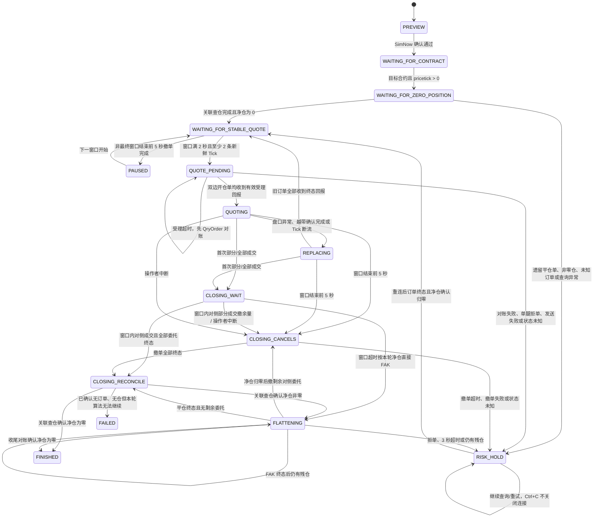

# SimNow 单合约报撤联调：运行与代码逻辑说明

本文是本项目实时网格报撤联调功能的交接文档。目标是让接手人能够从“如何启动”一路追踪到“一个 CTP 回报如何改变状态、产生什么动作、最终如何写入审计目录”。

本文对应的功能是单进程、单合约、受控的 SimNow 报撤测试器，不是生产交易系统，也不是离线回放器。代码、测试和 PRD 不一致时，先以当前代码行为为准，再同步修正文档和 PRD。

## 1. 先记住三条边界

1. [`run.py`](../run.py) 是只读连接入口。它可以登录、查询合约/资金/持仓、订阅 Tick，但不会调用 `send_order` 或 `cancel_order`。
2. [`run_live_grid.py`](../run_live_grid.py) 是独立的可下单入口。只有显式确认 SimNow，才会进入 CTP 连接和下单链路；策略 SHA-256 只用于展示、审计和复盘识别。
3. 真实成交、撤单生效和持仓变化只接受 CTP 委托、成交和持仓查询完成回报。行情穿过限价，只能触发报价保护或重定锚，不能直接推断成交。

功能明确不包含：跨合约对冲、生产柜台、实盘凭证变更、回放撮合、既有仓位接管、跨进程持久化托管、数据库和 Web UI。启动/重连会通过 CTP 查询目标合约当日委托、成交和持仓做一次安全清理，但不接管残仓或未知平仓单。多合约并发挂单已支持，见下节。

## 1bis. 多合约扩展（v2）

系统已从单合约扩展为多合约并发（[ADR 0002](adr/0002-multi-contract-per-session.md)）：

- 策略配置使用 `version: 2`：顶层仅有 `version` 和 `contracts` 数组，每个条目独立包含合约身份、手数、W/D/S、轮数上限与全部会话级时序/安全参数；整份配置一个 SHA-256。旧单合约扁平格式、顶层公共策略参数均被拒绝并提示迁移；历史审计仍可读取，不重写。
- 每个合约一个独立的 `LiveGridSession`（状态机本身未变）；适配层按 `(symbol, exchange)` 路由合约/行情/委托/成交事件，订阅全部目标合约。
- 启动/重连先查询目标委托和成交，再撤销目标合约遗留开仓单，最后执行账户级持仓查询；遗留平仓单、非零仓、未知订单状态或查询异常进入 `RISK_HOLD`，不发任何新委托。
- 报撤限额、首次成交收口、失败与超时均按会话独立；操作员中断广播至全部会话；运行在全部会话终态后结束。
- 审计目录每次运行一个 run 目录，内含每合约子目录（`symbol@exchange`，各自 `effective_strategy.json`/`events.jsonl`/`summary.json`），run 根目录另写整份生效配置、无凭证资金快照 `account.jsonl` 与全合约汇总 `summary.json`（`terminal_states`/`all_finished`/逐合约摘要）。

自 ADR 0003 起收口语义升级为连续挂单：每轮成交平仓回零后清锚重挂，直至最后一个 `quote_windows` 窗口结束、`max_round_trips` 轮数上限或操作员中断任一停止条件生效；每个窗口结束前固定 5 秒撤掉活动开仓报价，窗口恢复时重新通过稳定行情门槛。摘要新增 `round_trips` 与 `stop_reason`。下文其余章节描述的单合约状态机与收口规则对每个会话逐合约、逐轮成立。

## 2. 代码地图

| 文件 | 责任 | 交接时重点看什么 |
| --- | --- | --- |
| [`run.py`](../run.py) | 只读 CTP 连接命令 | 环境变量读取、登录、合约订阅、只读边界 |
| [`run_live_grid.py`](../run_live_grid.py) | 报撤测试入口 | 预览/确认、审计目录、启动异常、Ctrl+C 收口 |
| [`report.py`](../report.py) | 离线交易日成交明细与手动单 run 委托成交报告 | 审计目录扫描、因果轨迹校验/渲染、交易日归组、轮次重建、资金汇总 |
| [`live_grid/config.py`](../live_grid/config.py) | 策略配置校验与哈希 | 凭证拒绝、默认值、规范化 JSON、SimNow 确认和策略身份 |
| [`live_grid/session.py`](../live_grid/session.py) | 与 CTP 无关的确定性状态机 | 状态迁移、报价、撤换、收口、FAK、最终摘要 |
| [`live_grid/ctp_adapter.py`](../live_grid/ctp_adapter.py) | vn.py/CTP 与状态机之间的薄适配层 | 回报转换、请求号关联、委托/撤单/查仓动作转换 |
| [`live_grid/ctp_native.py`](../live_grid/ctp_native.py) | 按 `--env` 切换 SimNow/广发 CTP 原生库 | 必须在导入 `vnctptd`/`vnctpmd` 之前调用 |
| [`live_grid/audit.py`](../live_grid/audit.py) | 每次运行的无凭证审计写入 | `effective_strategy.json`、`events.jsonl`、`summary.json`、`account.jsonl` |
| [`vendor/vnpy_ctp`](../vendor/vnpy_ctp) | 项目内可追踪的 CTP 依赖 | 持仓查询完成事件和原生 CTP 扩展 |
| [`tests/test_session.py`](../tests/test_session.py) | 状态机主测试 seam | 所有关键安全路径，不需要真实 CTP |
| [`tests/test_ctp_adapter.py`](../tests/test_ctp_adapter.py) | CTP 依赖和适配层测试 | 空/非空持仓查询、请求关联、事件/动作转换 |
| [`tests/test_run_live_grid.py`](../tests/test_run_live_grid.py) | 入口异常审计测试 | adapter 尚未创建时摘要字段仍完整 |
| [`tests/test_report.py`](../tests/test_report.py) | 报告工具测试 | 合成审计目录进、HTML 出；交易日归组与盈亏口径 |
| [`.scratch/live-grid-simnow/PRD.md`](../.scratch/live-grid-simnow/PRD.md) | 功能规格 | 需求、测试决策、人工验收阶段 |
| [`docs/adr/0001-live-grid-state-uses-ctp-callbacks.md`](adr/0001-live-grid-state-uses-ctp-callbacks.md) | 架构约束 | CTP 回报是真实状态来源，不能复用行情模拟成交 |

## 3. 两个入口的运行方式

### 3.1 安装依赖

项目使用项目内可编辑的 `vnpy_ctp`，不是依赖某个人本机 `site-packages` 中的临时修改：

```bash
python3 -m venv .venv
source .venv/bin/activate
python -m pip install --upgrade pip
python -m pip install -r requirements.txt
```

`requirements.txt` 会安装 `vnpy` 和 `-e ./vendor/vnpy_ctp`。Mac 上如果原生扩展构建失败，先检查 C++ 编译器、Meson、Ninja 和当前 Python 架构；不要直接修改虚拟环境里的 `vnpy_ctp` 来绕过项目源码。

### 3.2 准备 CTP 环境变量

复制 [`.env.example`](../.env.example) 为 `.env`。只读和报撤入口都通过 [`run.py:load_settings`](../run.py) 读取以下变量：

```text
CTP_USER_ID
CTP_PASSWORD
CTP_BROKER_ID
CTP_TRADE_FRONT
CTP_MARKET_FRONT
CTP_7X24_TRADE_FRONT
CTP_7X24_MARKET_FRONT
CTP_GUANGFA_USER_ID
CTP_GUANGFA_PASSWORD
CTP_GUANGFA_BROKER_ID
CTP_GUANGFA_TRADE_FRONT
CTP_GUANGFA_MARKET_FRONT
CTP_GUANGFA_APP_ID
CTP_GUANGFA_AUTH_CODE
CTP_GUANGFA_PRODUCT_INFO   # 可选
CTP_APP_ID
CTP_AUTH_CODE
CTP_PRODUCT_INFO   # 可选
```

第一套环境（默认 `--env first`）继续使用 `CTP_TRADE_FRONT`、`CTP_MARKET_FRONT`。7×24 API 测试环境使用 `CTP_7X24_TRADE_FRONT`、`CTP_7X24_MARKET_FRONT`，两者共用 SimNow 账号类凭证。广发仿真使用完整独立的 `CTP_GUANGFA_*` 变量，启动时选择 `--env guangfa`。环境选择是每次启动时的人工显式动作，不会因断线、收盘或行情缺失自动切换。7×24 不提供结算服务，不能根据第一套的持仓或结算状态推断 7×24 的结果。

Mac 上 CTP 原生库按环境自动切换：`first`/`7x24` 使用标准版 `v6.7.7_MacOS`（`vendor/vnpy_ctp/vnpy_ctp/api/ctp_variants/simnow/`），`guangfa` 使用看穿式 `v6.7.7_MacOS_CP`（`ctp_variants/guangfa/`）。入口在导入 `vnpy_ctp` 原生扩展之前调用 [`live_grid/ctp_native.py`](../live_grid/ctp_native.py) 把对应文件拷进 active framework；同一进程内不可中途换库。

`CTP_SYMBOL`、`CTP_EXCHANGE` 只服务于普通只读连接的行情订阅；报撤测试的交易目标来自策略 JSON 的 `symbol` 和 `exchange`，不会从只读订阅设置继承。

加载环境并先检查配置：

```bash
set -a
source .env
set +a
python run.py --check --env first
```

`run.py --check` 只校验所选环境的必填环境变量，不连接 CTP。返回码为：`0` 配置有效，`2` 环境变量缺失或配置错误。7×24 和广发检查命令分别为 `python run.py --check --env 7x24`、`python run.py --check --env guangfa`。

### 3.3 只读连接

```bash
python run.py --env first
```

该入口建立 `EventEngine` 和 `MainEngine`，注册日志、资金、持仓、合约、Tick 处理器，随后连接 CTP。指定了 `CTP_SYMBOL` 时，目标合约回报到达后才发起行情订阅。诊断快照将目标合约/目标 Tick 与全量合约查询完成分开显示；后者可能因 SimNow 返回大量期权而延迟。交易 API 的通用请求错误会以 `交易接口报错` 写入日志，空错误回报不会被当成合约完成。

按 `Ctrl+C` 退出，连接会在 `finally` 中关闭。这个入口没有订单管理状态机，也没有任何 `send_order`/`cancel_order` 路径。

### 3.4 报撤入口

先从 [strategy.example.json](../strategy.example.json) 复制策略配置：

```bash
cp strategy.example.json strategy.json
# 将 symbol 改成当前 SimNow 合约查询返回的有效合约
```

先以预览模式运行：

```bash
python run_live_grid.py \
  --config strategy.json \
  --audit-dir audit \
  --env first
```

预览会：

- 读取并校验策略 JSON；
- 合并默认值，打印 effective 配置和 SHA-256；
- 写入一次审计目录；
- 不读取 CTP 凭证、不连接 CTP、不发送委托。

确认 effective 配置、目标合约和手数后，只需使用 SimNow 确认启动可下单命令：

```bash
python run_live_grid.py \
  --config strategy.json \
  --audit-dir audit \
  --env first \
  --confirm-simnow
```

进入 CTP 连接和下单链路的唯一启动确认条件是：

```text
confirm-simnow = true
```

7×24 环境需显式写出 `--env 7x24 --confirm-simulation`；它和第一套都保留零仓启动、收口和限流边界。运行级与合约级 `summary.json` 记录所选 `environment` 与 `market_data_mode=normal|replay_override`，不记录前置或凭证。历史化行情只能额外使用 `--allow-replay-market-data`，且必须同时满足 `--env 7x24 --confirm-simulation`。

策略 JSON 任何字段变化都会改变 effective 配置和哈希。哈希会随本次配置写入预览和审计，但不作为命令授权条件。

报撤入口主要返回码：

| 返回码 | 含义 |
| ---: | --- |
| `0` | 预览完成，或运行最终为 `FINISHED` |
| `1` | 会话最终为 `FAILED` |
| `2` | 策略配置读取/校验失败 |
| `3` | CTP 启动、连接或运行时异常 |
| `130` | 尚未创建 adapter 时收到 `Ctrl+C` |

## 4. 策略配置与风险参数

### 4.1 字段

顶层只接受 `version: 2` 和非空 `contracts`。下表除 `version` 外的字段均放在各 `contracts` 条目内，缺省值也按合约独立填充，不会继承其他合约的值。预览展示每个合约的完整生效值；相同数值只是配置相同，不表示共享状态或计数。

| 字段 | 必填/默认 | 校验与含义 |
| --- | --- | --- |
| `version` | 顶层必填 | 固定为 `2`，配置版本 |
| `symbol` | 必填 | 非空目标合约代码，来自策略配置 |
| `exchange` | 必填 | 自动转大写，支持 `CFFEX`、`SHFE`、`CZCE`、`DCE`、`INE`、`GFEX` |
| `target_lots` | 必填 | 每一侧开仓手数，正整数；当前没有额外绝对上限 |
| `w_ticks` | `20` | 正整数，W 宽度，单位为最小变动价位 |
| `d_ticks` | `20` | 正整数，D 距离，单位为最小变动价位 |
| `s_ticks` | `10` | 正整数，重定锚步长，单位为最小变动价位；不得大于 `w_ticks` |
| `book_protection_multiple` | `2` | 正数，盘口保护倍数 |
| `reanchor_confirmation_seconds` | `1` | LastPrice 越出当前 band 后的持续确认时间 |
| `stable_market_seconds` | `2` | 首次报价/恢复报价前的连续稳定行情窗口 |
| `max_tick_age_seconds` | 每个合约必填 | 本合约的 Tick 静默阈值；报价期间超过此时长没有有效 Tick 就安全撤单，恢复时重新走稳定行情门槛 |
| `action_limit_per_minute` | `60` | 普通报价提交和普通撤单的滚动一分钟上限 |
| `cancel_timeout_seconds` | `10` | 收口撤单等待终态的上限 |
| `flatten_timeout_seconds` | `3` | 一次受限 FAK 收口的时间上限 |
| `flatten_adverse_ticks` | `10` | FAK 允许相对初始可执行价的不利方向最大偏移 |
| `max_round_trips` | `10` | 本合约会话完成的往返轮数上限；达到后不影响其他合约 |
| `quote_windows` | 每个合约必填 | 按顺序排列的 `[{"start":"HH:MM","end":"HH:MM"}]` 报价窗口；支持相邻窗口跨午夜，不允许重叠；每段结束前 5 秒撤单 |
| `closing_wait_seconds` | `1` | 非负数，价差窗口时长；首次成交后对侧报价继续挂满该时长，0 表示不留窗口直接平仓 |
| `quote_ack_timeout_seconds` | `5` | 双边开仓单发送后等待两侧有效受理回报的上限；超时先用 `QryOrder` 对账，再决定是否撤单 |

配置还会拒绝：凭证字段、未知字段、空 symbol、非法交易所、非正数和非有限数。策略文件不应出现账号、密码、前置地址、AppID 或授权码。

一份配置只运行一个排程周期；进程可以在任一当前报价窗口内启动，但仍必须完成合约、零仓和稳定行情校验，窗口外不会提交新开仓单。跨午夜窗口启动时按当前时刻选择覆盖它的上一自然日排程；最后一个窗口结束并完成必要的撤单/持仓收口后，会话进入 `FINISHED`。交易所调整交易时段时，直接修改对应合约的 `quote_windows`，不再依赖单一全局收盘时刻。

### 4.2 规范化和哈希

[`MultiContractConfig.from_mapping`](../live_grid/config.py) 校验根节点后，逐合约复用 `StrategyConfig.from_mapping`：

1. 拒绝凭证字段；
2. 检查合约身份、手数、行情过期阈值和报价窗口等必填字段；
3. 对每个合约独立合并默认值并把交易所转成大写；
4. 校验正数、正整数和未知字段；
5. 将每个合约的完整生效值放回合约列表，用排序 key、无空格分隔符生成运行级 canonical JSON；
6. 对 canonical JSON 做 SHA-256，作为本次运行的策略身份。

审计里的 `effective_strategy.json` 保存的是合并默认值后的配置和哈希，不是原始 JSON 文本。交接或复盘时应优先看这个文件。

旧公共参数配置需把原公共值复制到每个合约条目再删除根节点对应字段，不要直接删掉导致回落默认值。现有策略文件已按原生效值迁移；结构变化会改变哈希，必须重新预览确认。旧审计中的根节点公共参数仅供历史展示和报告兼容，不作为新运行配置接受。

## 5. 状态机总览



`LiveGridSession.handle(event)` 是状态机唯一公开测试 seam：输入一个标准化外部事实，返回本次新产生的 `Action` 列表。状态机不直接导入 vn.py，不直接访问环境变量，也不自行制造订单回报。

## 6. 从 CTP 回报到状态机动作

### 6.1 标准化事件

[`CtpLiveGridAdapter`](../live_grid/ctp_adapter.py) 把 vn.py/CTP 对象转换成以下事件：

| 事件 | 来源 | 状态机用途 |
| --- | --- | --- |
| `ContractEvent` | `EVENT_CONTRACT` | 取得目标合约和真实 `pricetick`，触发启动查仓 |
| `TickEvent` | `EVENT_TICK` | 携带交易所时间、交易日、更新时间毫秒、涨跌停和本地接收序号；检查盘口、稳定门槛、重定锚和 FAK 可执行价 |
| `OrderEvent` | `EVENT_ORDER` | 更新订单状态、开平标记、OrderRef/订单号和 CTP 已报告的累计成交量；`traded` 增加与 `TradeEvent` 同为开仓成交入口 |
| `TradeEvent` | `EVENT_TRADE` | 记录真实成交，同样触发首次成交收口及等待窗口 |
| `PositionQueryCompleteEvent` | 项目扩展的 `ePositionQueryComplete` | 接收与本次请求号匹配的目标合约净仓 |
| `OrderQueryCompleteEvent` / `TradeQueryCompleteEvent` | 项目扩展的 CTP 查询完成事件 | 启动/重连安全清理目标合约遗留委托和成交 |
| `ConnectionEvent` / `OrderActionErrorEvent` | CTP 前置连接与报撤错误事件 | 断线、撤单失败或未知报单进入 `RISK_HOLD` |
| `ClockEvent` | `EVENT_TIMER` | 携带单调时钟与本地墙钟时间，推进交易窗口、稳定时间、撤单超时、FAK 超时和滚动限流窗口 |
| `InterruptEvent` | `Ctrl+C`/adapter interrupt | 进入人工结束收口路径 |

其中 `ContractEvent.size`（合约乘数）、`OrderEvent.exchange_time`（交易所报单时间）、`TradeEvent.exchange_time`（交易所成交时间）是随事件落审计的交易所事实，供离线交易日成交明细报告使用。普通行情模式下稳定门槛和报价新鲜度使用交易所 Tick 时间；本地单调时间只判断回调静默。7×24 回放覆盖开启后会在摘要中写入 `market_data_mode=replay_override`，但仍保留撤单、双边受理、盘口保护和订单恢复规则。

所有事件先经过目标合约过滤。目标不是策略 JSON 指定的 `symbol + exchange` 时，状态机不处理。

### 6.2 状态机产生的动作

| 动作 | 发送到 CTP 的内容 | 普通/安全限流 |
| --- | --- | --- |
| `submit_order` | `OrderRequest`，可为 OPEN/LIMIT 报价或 CLOSE/FAK 平仓 | 开仓报价计入普通动作；平仓标为安全动作 |
| `cancel_order` | `CancelRequest`，包含订单号、合约、交易所 | 重定锚撤单计入普通动作；成交/中断/异常收口撤单绕过普通限流 |
| `query_order` | 调用项目内 gateway 的当日委托查询 | 双边受理超时后先对账；用 session request id 和 CTP numeric request id 双向关联 |
| `query_position` | 调用项目内 gateway 的持仓查询 | 用 session request id 和 CTP numeric request id 双向关联 |
| `audit_warning` | 只写审计，不调用 CTP | 例如普通动作达到 60 次、旧订单终态回报延迟 |

adapter 的动作转换只做协议映射，不决定策略逻辑。提交成功后，它把 CTP 返回的订单号映射回 session 的 `client_id`；如果发送订单返回空值，则合成 `REJECTED` 委托事件，让状态机按拒单处理。

## 7. 启动门槛：为什么第一次不会立即挂单

确认通过后，session 从 `WAITING_FOR_CONTRACT` 开始。必须按以下顺序通过：

1. **目标合约元数据**：报撤入口把策略目标合约写入网关 `查询合约`，结算确认后按合约逐个 `ReqQryInstrument`，不再拉取 SimNow 全市场期权列表。收到目标合约的 `ContractEvent` 且 `pricetick` 为有限正数后才能继续。只读入口 `run.py` 仍查全市场。`pricetick` 只能来自 CTP 合约回报，不能写死。
2. **目标合约遗留委托/成交清理**：adapter 先查询目标合约当日委托和成交；活动 `OPEN` 委托全部自动撤销，活动 `CLOSE`、无法识别状态或撤单无法确认进入 `RISK_HOLD`。
3. **目标合约零仓**：清理完成后再执行持仓查询，只接受相同 request id 的完成事件。非零净仓或查询失败进入 `RISK_HOLD`，不会发送开仓订单。
4. **有效盘口**：LastPrice、BidPrice1、AskPrice1、涨跌停和 `pricetick` 都必须是有限正数，且 `bid <= ask`。
5. **盘口保护**：计算价差 tick 数：

   ```text
   spread_ticks = ceil((AskPrice1 - BidPrice1) / pricetick)
   ```

   必须严格满足：

   ```text
   W + D > book_protection_multiple × spread_ticks
   ```

6. **连续稳定窗口**：有效且通过盘口保护的 Tick 必须同时满足：
   - 窗口内至少 2 条有效 Tick；
   - 相邻两条 Tick 的间隔不超过该合约的 `max_tick_age_seconds`（等于则通过）；
   - 准备下单那一刻，最新 Tick 的年龄不超过 `max_tick_age_seconds`；
   - 窗口已持续 `stable_market_seconds`（默认 2 秒）。

   任一条件不满足都视为行情不稳定：清空稳定计时，从下一条有效 Tick 重新开始下一个 2 秒窗口。中间任何无效或过宽行情同样清空稳定计时。

只有第六步完成，才会发送一对双向被动开仓限价单；价格还必须满足 `BUY < AskPrice1`、`SELL > BidPrice1` 且两侧均在涨跌停范围内。两笔订单进入 `QUOTE_PENDING`，只有双边收到有效受理回报才进入 `QUOTING`。

## 8. 报价、重定锚和替换

### 8.1 W/D/S 报价

收到第一条稳定行情时，LastPrice 会按 CTP `pricetick` 转为 tick 整数锚点：

```text
anchor_ticks = round(LastPrice / pricetick)
distance_ticks = W + D

BUY  = (anchor_ticks - distance_ticks) × pricetick
SELL = (anchor_ticks + distance_ticks) × pricetick
```

每一侧数量都是 `target_lots`，订单类型是 `LIMIT`，偏移是 `OPEN`。计算后的价格必须为正数且天然按 tick 对齐。

状态机维护一个诊断 band：

```text
[anchor_ticks - W, anchor_ticks + W]
```

### 8.2 盘口异常暂停

在 `QUOTING` 状态收到无效或过宽盘口时，进入 `REPLACING`，以安全撤单方式撤掉现有报价，并等待所有旧订单终态。旧订单未收到 CTP 终态回报时，绝不提交替换报价。

同一状态下，时钟发现最近有效 Tick 的年龄超过该合约的 `max_tick_age_seconds`，也会进入安全撤单；这条规则独立于交易窗口，且窗口结束前 5 秒的收市撤单优先执行。行情恢复后必须重新收到至少两条新鲜有效 Tick，不能沿用断流前的报价。

### 8.3 越带重定锚

LastPrice 超出当前 band 后，不会立即替换：

1. 记录首次越带时间；
2. 持续越带达到 `reanchor_confirmation_seconds`，默认 1 秒；
3. 按 `s_ticks` 步长移动 anchor，直到新的 band 覆盖当前价格（配置校验强制 `s_ticks` ≤ `w_ticks`，保证步进后新带必然覆盖当前价，不会陷入反复撤挂）；
4. 先撤旧单，等待每一个旧单收到终态回报；
5. 重新进入稳定行情门槛：至少 2 条新鲜 Tick，相邻间隔与最新 Tick 年龄均不超过 `max_tick_age_seconds`，窗口满 `stable_market_seconds` 后才挂新的双向报价。

因此，替换链路的顺序固定为：

```text
旧报价 → 撤单请求 → CTP 旧单终态 → 稳定行情门槛 → 新报价
```

普通动作限额是滚动一分钟 60 次，普通报价提交和重定锚撤单都会计入。达到上限时只产生审计警告并暂停普通报价；成交收口、人工中断和盘口保护所需的安全撤单不因普通限流而静默跳过。

## 9. 首次成交后的价差窗口收口

### 9.1 触发条件与等待窗口

在 `QUOTING` 或 `REPLACING` 中，只要目标开仓单出现第一次 CTP 成交：

- 部分成交和全部成交一视同仁；
- 停止新增开仓报价，记录 `first_fill`；
- 进入 `CLOSING_WAIT`，**不撤销对侧报价**，对侧继续挂满 `closing_wait_seconds`（默认 1 秒，0 表示不留窗口）。

价格穿过限价但没有委托或成交回报，不会触发这条路径。

`OrderEvent` 的累计 `traded` 与 `TradeEvent` 是同一条开仓成交入口：任一通道上 `traded` 增加都会触发首次收口或窗口记账。成交回报按 `trade_id` 去重，窗口记账按每个委托的已入账差额累计，同一成交先到委托回报、后到成交流水只计一次。晚到的开仓成交回报会在窗口、平仓甚至终态后继续校正最终净仓，不能被忽略。

### 9.2 窗口的两条出口

- **窗口内对侧成交（价差完成）**：立即结束窗口，不等满时长。若全部委托自然终态，直接发起关联持仓查仓；若对侧只是部分成交，先撤掉剩余委托再查仓。查仓净仓为零即本轮完成，全程不产生任何 FAK。
- **窗口超时**：按本轮开仓净仓（窗口记账）直接进入受限 FAK 平仓，**平仓终态后**才撤销对侧报价，全部委托终态后发起收尾关联持仓查仓。窗口内同一委托的补成交会实时加大超时平仓量。

两条出口都以"全部委托终态 + 关联持仓查仓净仓为零"收尾；一轮结束不遗留委托、不遗留仓位。查仓失败即净仓未知，沿用失败路径并清空记账净仓。

### 9.3 撤单终态和超时

`CLOSING_CANCELS`（窗口内中断、对侧部分成交撤余量、平仓后撤对侧）会持续等待所有已知订单和待绑定订单的 CTP 终态：

- 全部收到 `ALLTRADED`、`CANCELLED` 或 `REJECTED`：记录 `cancellation_terminal=true`，发起新的 closing 持仓查询；
- 超过 `cancel_timeout_seconds`，默认 10 秒：记录 `cancel_timeout` 和 `cancellation_terminal=false`，仍然发起关联持仓查询，不恢复报价。

必要的安全撤单每次时钟事件都会重试。超时并不代表可以猜测仓位或直接断开连接。

### 9.4 关联持仓查询

closing query 必须匹配本次收口发起的 `closing_position_request_id`：

- request id 不匹配：忽略，不能启动平仓；
- 查询错误：`FAILED`，原因 `closing_position_query_failed`，净仓记为未知；
- 净仓为 0：根据此前是否有失败原因，进入 `FINISHED` 或 `FAILED`；
- 净仓非零：进入 `FLATTENING`。

adapter 维护两层 request id：CTP gateway 使用递增数字 id，session 使用 `position-1`、`position-2` 这样的逻辑 id。只有 adapter 映射到当前 session 请求后，标准化完成事件才会进入状态机。

## 10. 受限 FAK 平仓

`FLATTENING` 只使用 closing query 返回的真实净仓：

| 真实净仓 | 平仓方向 | 初始可执行价 |
| ---: | --- | --- |
| 正数（多仓） | `SELL` | 当前 `BidPrice1` |
| 负数（空仓） | `BUY` | 当前 `AskPrice1` |

偏移规则：目标交易所为 `SHFE` 或 `INE` 时使用 `CLOSETODAY`，其他支持交易所使用 `CLOSE`。拒单后不自动尝试另一种 offset。

每次 FAK 具有以下硬边界：

- 订单类型固定为 `FAK`；
- 数量是 `abs(final_net_position)`；
- 从当前对手方一档可执行价开始；
- 单次 flatten 流程最多持续 `flatten_timeout_seconds`，默认 3 秒；
- 后续重试的价格相对第一次可执行价最多向不利方向移动 `flatten_adverse_ticks`，默认 10 个 tick；
- 没有有效可执行盘口、收到拒单、超时或最终仍有残仓，都进入 `FAILED`，不改成市价单，也不无限追价。

如果 FAK 只成交一部分，等待该平仓订单终态后，按剩余确认净仓再发下一次受限 FAK。即使最终净仓已经归零，也要等所有 flatten 订单终态后才可 `FINISHED`。平仓完成后又收到会使仓位非零的晚到回报，状态会转为 `FAILED`，并保留失败原因。

## 11. Ctrl+C 和连接关闭

adapter 的 `interrupt()` 只向 session 注入 `InterruptEvent`，不会立即关闭 CTP：

- `WAITING_FOR_CONTRACT` / `WAITING_FOR_ZERO_POSITION`：尚未证明零仓，直接失败，原因 `interrupted_before_zero_position`；
- `WAITING_FOR_STABLE_QUOTE`：还没有开仓，可安全结束；
- `PAUSED`：当前不在任何报价窗口，已撤清开仓单；下一窗口时钟到达后重新等待稳定行情；
- `CLOSING_WAIT`：窗口期间中断，立即结束窗口并撤全部委托，走查仓、必要时 FAK 的人工结束收口；
- `QUOTING` / `REPLACING`：进入与首次成交相同的撤单、查仓、必要时 FAK 平仓路径；
- 已在 closing/flattening：继续等待已有收口链路；
- 终态：不重复处理。

主入口会等待 `FINISHED` 或 `FAILED` 后再关闭 adapter。交接人遇到“Ctrl+C 后程序没有立即退出”时，先区分两个阶段：终态打印之前的等待是撤单、查仓和平仓回报的保护逻辑，不是死循环；终态打印之后进程仍不退出则属关闭死锁（已在 12.4 描述的时序中修复），应视为缺陷上报。

## 12. CTP adapter 的关键细节

### 12.1 项目内依赖校验

`CtpLiveGridAdapter.start()` 第一件事是检查 `vnpy_ctp.__file__` 是否精确指向当前项目的：

```text
vendor/vnpy_ctp/vnpy_ctp/__init__.py
```

同时要求 `vnpy_ctp.gateway.position_query` 存在。路径不对、扩展无法加载或缺少持仓查询完成契约时，可下单入口硬失败；普通只读入口不通过这层订单能力检查。

### 12.2 事件注册

adapter 注册：

```text
EVENT_CONTRACT
EVENT_LOG
EVENT_TICK
EVENT_ORDER
EVENT_TRADE
EVENT_ACCOUNT
EVENT_POSITION_QUERY_COMPLETE
EVENT_CTP_CONNECTION
EVENT_CTP_ORDER_ACTION_ERROR
EVENT_CTP_ORDER_QUERY_COMPLETE
EVENT_CTP_TRADE_QUERY_COMPLETE
EVENT_TIMER
```

`EVENT_LOG` 用于把网关认证、结算和请求错误直接打印到终端，便于实盘启动时定位 CTP 侧问题。`EVENT_ACCOUNT` 消费网关定时器约每 4 秒轮询的资金回报，把仅含余额/可用/单调时间的资金快照写入 run 级 `account.jsonl`（资金账号属凭证，禁止落盘），供离线报告推算资金差净盈亏。

每个回调都在同一个 `RLock` 保护下进入 session，并把事件、产生的动作、状态前后值写入审计。

### 12.3 持仓查询完成事件

项目内 [`vendor/vnpy_ctp/vnpy_ctp/gateway/position_query.py`](../vendor/vnpy_ctp/vnpy_ctp/gateway/position_query.py) 扩展了通用完成事件。每次查询结束都会发布一次，即使没有任何持仓行；payload 包含：

- 发起查询的递增 numeric `request_id`；
- 该查询汇总出的 positions；
- `error_id`、`error_msg`。

adapter 只汇总目标合约：多仓量减空仓量得到净仓。其他合约的 position 行不会参与本次策略判断。

### 12.4 查仓发送重试与关闭时序

CTP 同一时刻只允许一个在途查询。报撤入口的合约查询只覆盖策略目标，不再占用数分钟拉取全市场期权；只读入口仍查全市场。启动/重连按“委托 → 成交 → 持仓”顺序执行；目标合约遗留 `OPEN` 委托自动撤销，`CLOSE` 委托、未知状态或撤单未确认停在 `RISK_HOLD`。每类查询的发送失败都进入待重试队列，随 `EVENT_TIMER` 按退避间隔重发（1s→2s→4s，之后固定 5s，避免持续踩中 CTP 秒级流控），最多 `POSITION_QUERY_MAX_ATTEMPTS = 60` 次；耗尽后发布结构化错误事件，状态机继续保持风险托管而不是关闭连接。网关层（`CtpTdApi.last_query_send_refusal`）会保留最近一次 `ReqQry*` 被拒的原始返回码描述，耗尽事件的 `error_msg` 会携带它（例如“CTP 持仓查询请求未发送（ReqQryInvestorPosition 返回 -3）”），便于区分网络失败与流控拒绝。

`close()` 的调用时序受锁约束：`EventEngine.stop()` 会 join 事件引擎工作线程，而工作线程可能正阻塞在 adapter 的 `RLock` 回调上。持锁调用 `MainEngine.close()` 会造成互等死锁，表现为终态后进程不退出。正确顺序是：锁内仅把 `main_engine` 换手置空，释放锁后关闭引擎，最后再持锁关闭审计。

原生扩展的 `MdApi::exit()`/`TdApi::exit()` 还有一个 GIL 死锁：pybind 默认在持有 GIL 的状态下调用 C++，`exit()` 内的 `task_thread.join()` 会与工作线程回调里的 `gil_scoped_acquire` 互等（2026-08-17 实盘关闭时触发过一次）。项目内 `vnctpmd.cpp`/`vnctptd.cpp` 已在 join 前用 `gil_scoped_release` 释放 GIL，重建扩展即生效；升级 vendor 版本时必须保留该补丁。

全部会话终态后、关引擎前，入口会多等 5 秒再关闭：网关资金轮询约每 4 秒一次，这个等待保证"最后平仓终态后"的资金快照（含手续费）落盘，它是离线报告资金差净盈亏的右边界。

## 13. 审计目录和最终摘要

每次成功读取策略配置后，入口创建一个类似下面的唯一目录：

```text
audit/
└── 20260814T120000.123456Z-a1b2c3d4e5/
    ├── effective_strategy.json
    ├── account.jsonl
    ├── summary.json
    └── cu2610@SHFE/            ← 每个目标合约一个子目录
        ├── effective_strategy.json
        ├── events.jsonl
        └── summary.json
```

### 13.1 `effective_strategy.json`

保存合并默认值后的无凭证配置和 `sha256`。这是本次策略身份和复盘策略参数的依据，不是下单授权记录。

### 13.2 `events.jsonl`

每一行记录一次进入 adapter/session 的标准化事件，一行 = 一个事件。字段含义以一条真实记录为例：

```json
{
  "event": {
    "type": "ContractEvent",
    "data": {"symbol": "cu2610", "pricetick": 10.0, "size": 5, "exchange": "SHFE"}
  },
  "actions": [
    {"data": {"kind": "query_position", "payload": {"request_id": "position-1", "phase": "startup"}}}
  ],
  "at": 2074880.281948625,
  "state_before": "WAITING_FOR_CONTRACT",
  "state_after": "WAITING_FOR_ZERO_POSITION"
}
```

- `event`：输入。`type` 是事件类型（含连接、报撤错误、订单/成交查询完成事件），`data` 是事件内容；Tick、委托与成交里的交易所时间字段均落审计。
- `actions`：输出。状态机因该事件产生的 CTP 动作（`submit_order` / `cancel_order` / `query_order` / `query_position`）及其参数；空数组表示该事件没有触发任何动作（多数时钟与行情事件为空）。
- `at`：审计落笔的 `time.monotonic()` 秒数，不是墙上时间。相邻两行相减得到精确间隔，报告中的挂单等待与持仓时长由此计算。
- `state_before` / `state_after`：会话状态机消费该事件前后的状态；两者不等即一次状态跳变，可据此定位触发跳变的具体事件行。

事件和动作经过递归凭证字段检查。检测到密码、账号、前置地址、授权码等字段时，审计写入会抛出 `AuditError`。

### 13.3 `summary.json`

最终摘要包含：

```text
terminal_state
market_data_mode
target_symbol / target_exchange / target_lots
strategy_hash
startup_position_result
first_fill
cancellation_terminal
closing_position_request_id
closing_position_result
flatten_attempts
final_net_position
active_order_count / active_orders
state_transitions
failure_reason
```

风险未清时 `terminal_state=RISK_HOLD` 不是安全结束；只有 `active_order_count=0` 且 `final_net_position=0` 才允许关闭 CTP。普通 `Ctrl+C` 在该状态只记录告警并继续查询/重试。

判断结果时不能只看 `terminal_state`：

- `FINISHED` 还要确认 `final_net_position == 0`、`active_order_count == 0`，并检查撤单/平仓字段；
- `FAILED` 要重点看 `failure_reason`、`final_net_position` 和 `active_orders`，失败不代表风险已经归零；
- `PREVIEW + confirmation_required` 表示缺少 `--confirm-simnow`，没有连接、没有下单，不是一次真实联调成功；
- `audit_warning` 只是审计提示，不等于订单成交或失败。

常见失败原因包括：

```text
startup_position_query_failed
nonzero_startup_position
interrupted_before_zero_position
cancel_timeout
closing_position_query_failed
no_executable_quote
flatten_rejected
flatten_timeout
late_opening_fill_after_finish
late_flatten_fill_after_finish
```

### 13.4 `account.jsonl`

run 根目录的资金快照流水，每行是网关一次资金回报的 `at`（单调时间，与逐事件审计同时钟域）、`balance`、`available`。资金账号等凭证字段在审计边界被拒绝，永远不会出现在该文件。离线报告用它取"首个委托前最后一个快照"与"最后平仓终态后第一个快照"的资金差作为真实净盈亏，缺失边界时取最近快照并在报告标注。

资金差只在账户仅运行本策略时才等于策略净盈亏：账户内其他合约仓位的浮动盈亏会随每份快照混入该数字（2026-08-17 实盘验证时，账户遗留的一手 MA609 多单就以 ±几十元的浮动盈亏污染了当日资金差）。报告页对此有显式声明。

### 13.5 手动生成单 run 委托成交报告

运行结束后，如需复盘某一次完整 run，再手动执行：

```bash
python report.py --run-dir audit/<run-id> --out-dir reports
```

命令只读取该 run 已落盘的 `effective_strategy.json`、各合约 `events.jsonl`、`summary.json` 和可选的 `account.jsonl`，不会重放状态机，也不会连接 SimNow。报告生成到 `reports/run-<run-id>.html`，不会写回审计目录；需要直接打开时追加 `--open`。

单 run 模式只接受带 `audit_schema_version: 2`、结构化审计因果轨迹和完整终态摘要的 run。旧格式、活动中或缺少摘要的目录会以非零状态拒绝，不生成降级页面。页面按合约展示审计品种身份、运行参数、运行因果时间线、完整逻辑委托、默认收起的详情、成交/收口链路、轮次毛盈亏和可证明的资金结果。

## 14. 推荐交接/验收顺序

### 阶段 A：本地无凭证验证

```bash
.venv/bin/python -m unittest discover -s tests -q
.venv/bin/python -m compileall -q live_grid run_live_grid.py report.py tests vendor/vnpy_ctp/vnpy_ctp
```

当前测试 seam 不需要真实 CTP 凭证，覆盖配置确认、逐合约 Tick 阈值、交易窗口/跨午夜收市前撤单、零仓门槛、稳定行情、盘口保护、重定锚、替换、普通/安全动作限流、部分/全部成交、晚到回报、关联查仓、FAK、拒单、超时和中断。

### 阶段 B：只读 SimNow 联调

1. 填 `.env`；
2. `python run.py --check`；
3. `python run.py`；
4. 确认登录、合约、资金、持仓和目标 Tick；
5. `Ctrl+C` 退出并确认只读入口没有委托动作。

### 阶段 C：远价无成交报撤验收

1. 从当前合约回报确认策略目标 `symbol/exchange`；
2. 确认策略目标合约净仓为零；
3. 用最小、明确的 `target_lots` 生成策略配置；
4. 先运行预览，人工核对 effective 配置和哈希；哈希用于确认审计身份，不是启动门禁；
5. 只在 SimNow 环境用 `--confirm-simnow` 启动；
6. 选择远离成交的价格环境，观察元数据、零仓查询、稳定行情和挂单。报撤入口只查询策略目标合约，合约元数据应在数秒内到达；启动查仓若被流控拒绝仍按 12.4 重试，但不应再出现数分钟的全市场合约流等待；
7. 操作者中断，等待完整撤单/查仓收口；
8. 从 `summary.json` 确认没有活动订单和残余净仓。

### 阶段 D：受控首次成交验收

在阶段 C 成功后，再安排有明确操作者和回滚/人工接管安排的受控首次成交。执行清单、逐字段通过判据和当前进度见 [`live-grid-acceptance.md`](live-grid-acceptance.md)，配套配置为 [`strategy-stage-d.json`](../strategy-stage-d.json)。重点观察：

- 第一笔部分成交是否立即停止新增报价；
- 剩余测试订单是否全部撤销并收到终态；
- closing query 是否使用本次 request id；
- FAK 是否按实际净仓、正确方向和 offset 发出；
- `summary.json` 是否明确记录最终净仓、活动订单和失败原因。

随后可按 PRD 观察拒单、撤单超时、无可执行盘口、FAK 超时和不完整平仓等失败场景。每个场景都应保存独立审计目录，不要用终端输出代替审计证据。

## 15. 交接时的排查顺序

遇到“没有下单”时，按下面顺序查：

1. 是否只运行了预览，或者缺少 `--confirm-simnow`；
2. 策略 JSON 的目标 `symbol/exchange` 是否与当前 CTP 合约回报一致；
3. `pricetick` 是否为正；
4. startup `query_position` 是否完成且 request id 匹配；被拒发送会按 12.4 的退避间隔（1s→2s→4s→固定5s）重试最多 60 次，等待期间不算失败，耗尽事件的 error_msg 携带 CTP 原始返回码；
5. 目标合约净仓是否确实为零；
6. Bid/Ask/Last 是否有效，且严格通过盘口保护；
7. 当前合约的稳定行情窗口是否满 2 秒，是否至少 2 条有效 Tick，最新 Tick 是否仍在该合约配置的阈值内；
8. 当前本地时间是否仍在该合约的 `quote_windows` 内，是否已进入窗口结束前 5 秒的撤单区间；
9. 普通动作 60 次滚动限流是否已暂停报价。

遇到“没有替换报价”时，先查旧订单是否收到 CTP 终态。实现故意不以本地一秒观察阈值代替真实回报；`replacement_waiting_for_terminal_order_callbacks` 只是一条审计警告。

遇到“平仓没有结束”时，先查：

1. closing query 是否返回了目标合约实际净仓；
2. FAK 方向是否与净仓相反；
3. SHFE/INE 是否使用 `CLOSETODAY`；
4. 当前 Bid/Ask 是否可执行；
5. 是否已达到 3 秒或 10 tick 不利价格边界；
6. `final_net_position` 和 `active_orders` 是否仍然非零。

不要通过删除 audit 文件、重启进程或修改 offset 来“清理”未完成收口；本功能没有跨进程订单恢复能力，残余风险必须显式交给操作者处理。

## 16. 维护规则

- 新增状态、事件、动作或配置字段时，同时更新 `live_grid/session.py`、对应测试、本文和 PRD；
- 新增策略配置字段必须重新生成 canonical JSON 和哈希，并确认审计文件记录了新的策略身份；哈希不再作为下单门禁；
- 不要让 `run.py` 获得隐藏下单模式；可下单能力必须继续留在独立的 `run_live_grid.py`；
- 不要把行情 crossing 写成成交逻辑；只能由 CTP order/trade callback 推进成交状态；
- 修改 `vnpy_ctp` 时保持 `vendor/vnpy_ctp` 可追踪、可编辑，并补充 position-query-complete 的确定性测试；
- 发布或交接前至少运行完整 unittest、compileall，并保留最后一次本地验证结果；真实 SimNow 验收必须单独标注为已执行或 pending。
