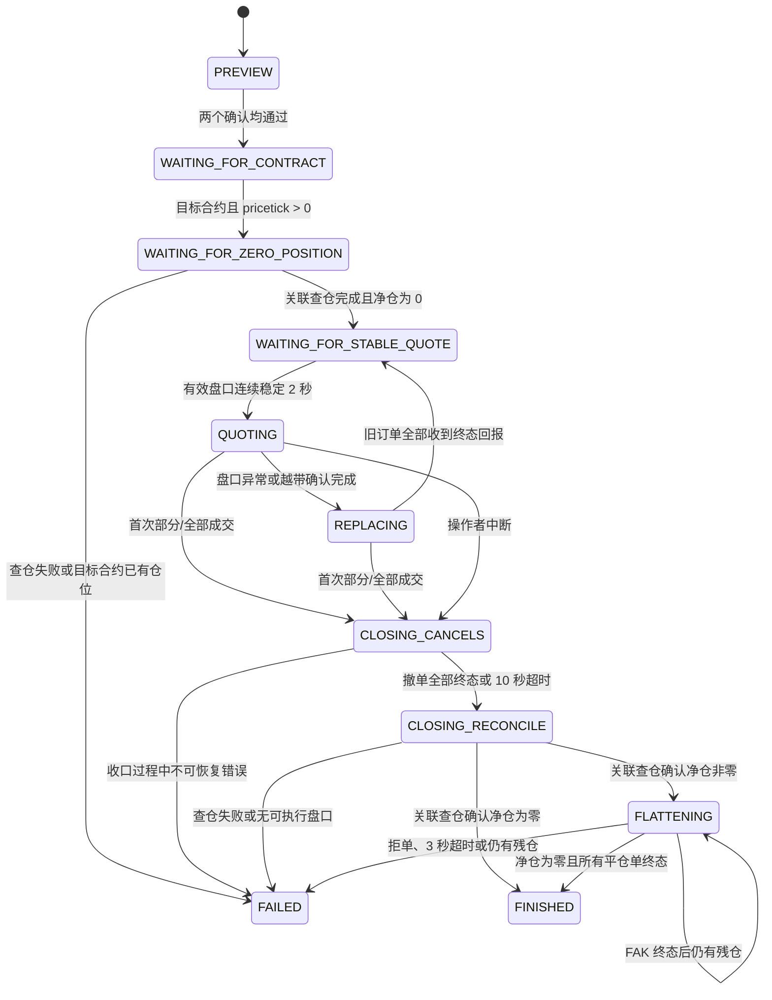

# SimNow 单合约报撤联调：运行与代码逻辑说明

本文是本项目实时网格报撤联调功能的交接文档。目标是让接手人能够从“如何启动”一路追踪到“一个 CTP 回报如何改变状态、产生什么动作、最终如何写入审计目录”。

本文对应的功能是单进程、单合约、受控的 SimNow 报撤测试器，不是生产交易系统，也不是离线回放器。代码、测试和 PRD 不一致时，先以当前代码行为为准，再同步修正文档和 PRD。

## 1. 先记住三条边界

1. [`run.py`](../run.py) 是只读连接入口。它可以登录、查询合约/资金/持仓、订阅 Tick，但不会调用 `send_order` 或 `cancel_order`。
2. [`run_live_grid.py`](../run_live_grid.py) 是独立的可下单入口。只有显式确认 SimNow，并提供当前有效策略配置的 SHA-256 哈希前缀，才会进入 CTP 连接和下单链路。
3. 真实成交、撤单生效和持仓变化只接受 CTP 委托、成交和持仓查询完成回报。行情穿过限价，只能触发报价保护或重定锚，不能直接推断成交。

功能明确不包含：多合约/对冲、生产柜台、实盘凭证变更、回放撮合、进程重启后的订单恢复、既有仓位接管、数据库持久化和 Web UI。

## 2. 代码地图

| 文件 | 责任 | 交接时重点看什么 |
| --- | --- | --- |
| [`run.py`](../run.py) | 只读 CTP 连接命令 | 环境变量读取、登录、合约订阅、只读边界 |
| [`run_live_grid.py`](../run_live_grid.py) | 报撤测试入口 | 预览/确认、审计目录、启动异常、Ctrl+C 收口 |
| [`live_grid/config.py`](../live_grid/config.py) | 策略配置校验与哈希 | 凭证拒绝、默认值、规范化 JSON、提交确认 |
| [`live_grid/session.py`](../live_grid/session.py) | 与 CTP 无关的确定性状态机 | 状态迁移、报价、撤换、收口、FAK、最终摘要 |
| [`live_grid/ctp_adapter.py`](../live_grid/ctp_adapter.py) | vn.py/CTP 与状态机之间的薄适配层 | 回报转换、请求号关联、委托/撤单/查仓动作转换 |
| [`live_grid/audit.py`](../live_grid/audit.py) | 每次运行的无凭证审计写入 | `effective_strategy.json`、`events.jsonl`、`summary.json` |
| [`vendor/vnpy_ctp`](../vendor/vnpy_ctp) | 项目内可追踪的 CTP 依赖 | 持仓查询完成事件和原生 CTP 扩展 |
| [`tests/test_session.py`](../tests/test_session.py) | 状态机主测试 seam | 所有关键安全路径，不需要真实 CTP |
| [`tests/test_ctp_adapter.py`](../tests/test_ctp_adapter.py) | CTP 依赖和适配层测试 | 空/非空持仓查询、请求关联、事件/动作转换 |
| [`tests/test_run_live_grid.py`](../tests/test_run_live_grid.py) | 入口异常审计测试 | adapter 尚未创建时摘要字段仍完整 |
| [`.scratch/live-grid-simnow/PRD.md`](../.scratch/live-grid-simnow/PRD.md) | 功能规格 | 需求、测试决策、人工验收阶段 |
| [`docs/adr/0001-live-grid-state-uses-ctp-callbacks.md`](adr/0001-live-grid-state-uses-ctp-callbacks.md) | 架构约束 | CTP 回报是真实状态来源，不能复用行情模拟成交 |

## 3. 两个入口的运行方式

### 3.1 安装依赖

项目使用项目内可编辑的 `vnpy_ctp`，不是依赖某个人本机 `site-packages` 中的临时修改：

```bash
python3 -m venv .venv
source .venv/bin/activate
python -m pip install --upgrade pip
python -m pip install -r requirements.txt
```

`requirements.txt` 会安装 `vnpy` 和 `-e ./vendor/vnpy_ctp`。Mac 上如果原生扩展构建失败，先检查 C++ 编译器、Meson、Ninja 和当前 Python 架构；不要直接修改虚拟环境里的 `vnpy_ctp` 来绕过项目源码。

### 3.2 准备 CTP 环境变量

复制 [`.env.example`](../.env.example) 为 `.env`。只读和报撤入口都通过 [`run.py:load_settings`](../run.py) 读取以下变量：

```text
CTP_USER_ID
CTP_PASSWORD
CTP_BROKER_ID
CTP_TRADE_FRONT
CTP_MARKET_FRONT
CTP_APP_ID
CTP_AUTH_CODE
CTP_PRODUCT_INFO   # 可选
```

`CTP_SYMBOL`、`CTP_EXCHANGE` 只服务于普通只读连接的行情订阅；报撤测试的交易目标来自策略 JSON 的 `symbol` 和 `exchange`，不会从只读订阅设置继承。

加载环境并先检查配置：

```bash
set -a
source .env
set +a
python run.py --check
```

`run.py --check` 只校验必填环境变量，不连接 CTP。返回码为：`0` 配置有效，`2` 环境变量缺失或配置错误。

### 3.3 只读连接

```bash
python run.py
```

该入口建立 `EventEngine` 和 `MainEngine`，注册日志、资金、持仓、合约、Tick 处理器，随后连接 CTP。指定了 `CTP_SYMBOL` 时，目标合约回报到达后才发起行情订阅。

按 `Ctrl+C` 退出，连接会在 `finally` 中关闭。这个入口没有订单管理状态机，也没有任何 `send_order`/`cancel_order` 路径。

### 3.4 报撤入口

先从 [strategy.example.json](../strategy.example.json) 复制策略配置：

```bash
cp strategy.example.json strategy.json
# 将 symbol 改成当前 SimNow 合约查询返回的有效合约
```

先以预览模式运行：

```bash
python run_live_grid.py \
  --config strategy.json \
  --audit-dir audit
```

预览会：

- 读取并校验策略 JSON；
- 合并默认值，打印 effective 配置和 SHA-256；
- 写入一次审计目录；
- 不读取 CTP 凭证、不连接 CTP、不发送委托。

确认 effective 配置、目标合约、手数和哈希后，才使用可下单命令：

```bash
python run_live_grid.py \
  --config strategy.json \
  --audit-dir audit \
  --confirm-simnow \
  --confirm-hash <策略哈希前八位或更长前缀>
```

提交条件是两个条件同时满足：

```text
confirm-simnow = true
且 confirm-hash 非空、长度至少 8、匹配当前 effective 配置的 SHA-256 前缀
```

策略 JSON 任何字段变化都会改变 effective 配置和哈希，旧的确认前缀不会继续授权新的配置。

报撤入口主要返回码：

| 返回码 | 含义 |
| ---: | --- |
| `0` | 预览完成，或运行最终为 `FINISHED` |
| `1` | 会话最终为 `FAILED` |
| `2` | 策略配置读取/校验失败 |
| `3` | CTP 启动、连接或运行时异常 |
| `130` | 尚未创建 adapter 时收到 `Ctrl+C` |

## 4. 策略配置与风险参数

### 4.1 字段

| 字段 | 必填/默认 | 校验与含义 |
| --- | --- | --- |
| `version` | 必填 | 正整数，配置版本 |
| `symbol` | 必填 | 非空目标合约代码，来自策略配置 |
| `exchange` | 必填 | 自动转大写，支持 `CFFEX`、`SHFE`、`CZCE`、`DCE`、`INE`、`GFEX` |
| `target_lots` | 必填 | 每一侧开仓手数，正整数；当前没有额外绝对上限 |
| `w_ticks` | `20` | 正整数，W 宽度，单位为最小变动价位 |
| `d_ticks` | `20` | 正整数，D 距离，单位为最小变动价位 |
| `s_ticks` | `10` | 正整数，重定锚步长，单位为最小变动价位 |
| `book_protection_multiple` | `2` | 正数，盘口保护倍数 |
| `reanchor_confirmation_seconds` | `1` | LastPrice 越出当前 band 后的持续确认时间 |
| `stable_market_seconds` | `2` | 首次报价/恢复报价前的连续稳定行情时间 |
| `action_limit_per_minute` | `60` | 普通报价提交和普通撤单的滚动一分钟上限 |
| `cancel_timeout_seconds` | `10` | 收口撤单等待终态的上限 |
| `flatten_timeout_seconds` | `3` | 一次受限 FAK 收口的时间上限 |
| `flatten_adverse_ticks` | `10` | FAK 允许相对初始可执行价的不利方向最大偏移 |

配置还会拒绝：凭证字段、未知字段、空 symbol、非法交易所、非正数和非有限数。策略文件不应出现账号、密码、前置地址、AppID 或授权码。

### 4.2 规范化和哈希

[`StrategyConfig.from_mapping`](../live_grid/config.py) 的处理顺序是：

1. 拒绝凭证字段；
2. 检查四个必填字段；
3. 合并默认值并把交易所转成大写；
4. 校验正数、正整数和未知字段；
5. 用排序 key、无空格分隔符生成 canonical JSON；
6. 对 canonical JSON 做 SHA-256，作为本次运行的策略身份。

审计里的 `effective_strategy.json` 保存的是合并默认值后的配置和哈希，不是原始 JSON 文本。交接或复盘时应优先看这个文件。

## 5. 状态机总览



`LiveGridSession.handle(event)` 是状态机唯一公开测试 seam：输入一个标准化外部事实，返回本次新产生的 `Action` 列表。状态机不直接导入 vn.py，不直接访问环境变量，也不自行制造订单回报。

## 6. 从 CTP 回报到状态机动作

### 6.1 标准化事件

[`CtpLiveGridAdapter`](../live_grid/ctp_adapter.py) 把 vn.py/CTP 对象转换成以下事件：

| 事件 | 来源 | 状态机用途 |
| --- | --- | --- |
| `ContractEvent` | `EVENT_CONTRACT` | 取得目标合约和真实 `pricetick`，触发启动查仓 |
| `TickEvent` | `EVENT_TICK` | 检查盘口、稳定门槛、重定锚和 FAK 可执行价 |
| `OrderEvent` | `EVENT_ORDER` | 更新订单状态和 CTP 已报告的累计成交量 |
| `TradeEvent` | `EVENT_TRADE` | 记录真实成交，并触发首次成交收口 |
| `PositionQueryCompleteEvent` | 项目扩展的 `ePositionQueryComplete` | 接收与本次请求号匹配的目标合约净仓 |
| `ClockEvent` | `EVENT_TIMER` | 推进稳定时间、撤单超时、FAK 超时和滚动限流窗口 |
| `InterruptEvent` | `Ctrl+C`/adapter interrupt | 进入人工结束收口路径 |

所有事件先经过目标合约过滤。目标不是策略 JSON 指定的 `symbol + exchange` 时，状态机不处理。

### 6.2 状态机产生的动作

| 动作 | 发送到 CTP 的内容 | 普通/安全限流 |
| --- | --- | --- |
| `submit_order` | `OrderRequest`，可为 OPEN/LIMIT 报价或 CLOSE/FAK 平仓 | 开仓报价计入普通动作；平仓标为安全动作 |
| `cancel_order` | `CancelRequest`，包含订单号、合约、交易所 | 重定锚撤单计入普通动作；成交/中断/异常收口撤单绕过普通限流 |
| `query_position` | 调用项目内 gateway 的持仓查询 | 用 session request id 和 CTP numeric request id 双向关联 |
| `audit_warning` | 只写审计，不调用 CTP | 例如普通动作达到 60 次、旧订单终态回报延迟 |

adapter 的动作转换只做协议映射，不决定策略逻辑。提交成功后，它把 CTP 返回的订单号映射回 session 的 `client_id`；如果发送订单返回空值，则合成 `REJECTED` 委托事件，让状态机按拒单处理。

## 7. 启动门槛：为什么第一次不会立即挂单

确认通过后，session 从 `WAITING_FOR_CONTRACT` 开始。必须按以下顺序通过：

1. **目标合约元数据**：收到策略目标合约的 `ContractEvent`，且 `pricetick` 为有限正数。`pricetick` 只能来自 CTP 合约回报，不能写死。
2. **目标合约零仓**：session 发出带 `phase=startup` 的 `query_position`，只接受相同 request id 的完成事件。非零净仓直接 `FAILED`，不会发送开仓订单。
3. **有效盘口**：LastPrice、BidPrice1、AskPrice1 和 `pricetick` 都必须是有限正数，且 `bid <= ask`。
4. **盘口保护**：计算价差 tick 数：

   ```text
   spread_ticks = ceil((AskPrice1 - BidPrice1) / pricetick)
   ```

   必须严格满足：

   ```text
   W + D > book_protection_multiple × spread_ticks
   ```

5. **连续稳定时间**：有效且通过盘口保护的 Tick 连续保持 `stable_market_seconds`，默认 2 秒。中间任何无效或过宽行情都会清空稳定计时。

只有第五步完成，才会发送一对双向被动开仓限价单。

## 8. 报价、重定锚和替换

### 8.1 W/D/S 报价

收到第一条稳定行情时，LastPrice 会按 CTP `pricetick` 转为 tick 整数锚点：

```text
anchor_ticks = round(LastPrice / pricetick)
distance_ticks = W + D

BUY  = (anchor_ticks - distance_ticks) × pricetick
SELL = (anchor_ticks + distance_ticks) × pricetick
```

每一侧数量都是 `target_lots`，订单类型是 `LIMIT`，偏移是 `OPEN`。计算后的价格必须为正数且天然按 tick 对齐。

状态机维护一个诊断 band：

```text
[anchor_ticks - W, anchor_ticks + W]
```

### 8.2 盘口异常暂停

在 `QUOTING` 状态收到无效或过宽盘口时，进入 `REPLACING`，以安全撤单方式撤掉现有报价，并等待所有旧订单终态。旧订单未收到 CTP 终态回报时，绝不提交替换报价。

### 8.3 越带重定锚

LastPrice 超出当前 band 后，不会立即替换：

1. 记录首次越带时间；
2. 持续越带达到 `reanchor_confirmation_seconds`，默认 1 秒；
3. 按 `s_ticks` 步长移动 anchor，直到新的 band 覆盖当前价格；
4. 先撤旧单，等待每一个旧单收到终态回报；
5. 重新进入稳定行情门槛，连续稳定 2 秒后才挂新的双向报价。

因此，替换链路的顺序固定为：

```text
旧报价 → 撤单请求 → CTP 旧单终态 → 稳定行情门槛 → 新报价
```

普通动作限额是滚动一分钟 60 次，普通报价提交和重定锚撤单都会计入。达到上限时只产生审计警告并暂停普通报价；成交收口、人工中断和盘口保护所需的安全撤单不因普通限流而静默跳过。

## 9. 首次成交后的单次收口

### 9.1 触发条件

在 `QUOTING` 或 `REPLACING` 中，只要目标开仓单出现第一次 CTP 成交：

- 部分成交和全部成交一视同仁；
- 停止新增开仓报价；
- 记录 `first_fill`；
- 进入 `CLOSING_CANCELS`；
- 对所有剩余测试订单发起安全撤单。

价格穿过限价但没有 `TradeEvent`，不会触发这条路径。

订单回报中的累计 `traded` 和成交回报中的 `TradeEvent.volume` 都会参与成交量更新；成交回报按 `trade_id` 去重。晚到的开仓订单/成交回报会在收口、平仓甚至终态后继续校正最终净仓，不能被忽略。

### 9.2 撤单终态和超时

`CLOSING_CANCELS` 会持续等待所有已知订单和待绑定订单的 CTP 终态：

- 全部收到 `ALLTRADED`、`CANCELLED` 或 `REJECTED`：记录 `cancellation_terminal=true`，发起新的 closing 持仓查询；
- 超过 `cancel_timeout_seconds`，默认 10 秒：记录 `cancel_timeout` 和 `cancellation_terminal=false`，仍然发起关联持仓查询，不恢复报价。

必要的安全撤单每次时钟事件都会重试。超时并不代表可以猜测仓位或直接断开连接。

### 9.3 关联持仓查询

closing query 必须匹配本次收口发起的 `closing_position_request_id`：

- request id 不匹配：忽略，不能启动平仓；
- 查询错误：`FAILED`，原因 `closing_position_query_failed`；
- 净仓为 0：根据此前是否有失败原因，进入 `FINISHED` 或 `FAILED`；
- 净仓非零：进入 `FLATTENING`。

adapter 维护两层 request id：CTP gateway 使用递增数字 id，session 使用 `position-1`、`position-2` 这样的逻辑 id。只有 adapter 映射到当前 session 请求后，标准化完成事件才会进入状态机。

## 10. 受限 FAK 平仓

`FLATTENING` 只使用 closing query 返回的真实净仓：

| 真实净仓 | 平仓方向 | 初始可执行价 |
| ---: | --- | --- |
| 正数（多仓） | `SELL` | 当前 `BidPrice1` |
| 负数（空仓） | `BUY` | 当前 `AskPrice1` |

偏移规则：目标交易所为 `SHFE` 或 `INE` 时使用 `CLOSETODAY`，其他支持交易所使用 `CLOSE`。拒单后不自动尝试另一种 offset。

每次 FAK 具有以下硬边界：

- 订单类型固定为 `FAK`；
- 数量是 `abs(final_net_position)`；
- 从当前对手方一档可执行价开始；
- 单次 flatten 流程最多持续 `flatten_timeout_seconds`，默认 3 秒；
- 后续重试的价格相对第一次可执行价最多向不利方向移动 `flatten_adverse_ticks`，默认 10 个 tick；
- 没有有效可执行盘口、收到拒单、超时或最终仍有残仓，都进入 `FAILED`，不改成市价单，也不无限追价。

如果 FAK 只成交一部分，等待该平仓订单终态后，按剩余确认净仓再发下一次受限 FAK。即使最终净仓已经归零，也要等所有 flatten 订单终态后才可 `FINISHED`。平仓完成后又收到会使仓位非零的晚到回报，状态会转为 `FAILED`，并保留失败原因。

## 11. Ctrl+C 和连接关闭

adapter 的 `interrupt()` 只向 session 注入 `InterruptEvent`，不会立即关闭 CTP：

- `WAITING_FOR_CONTRACT` / `WAITING_FOR_ZERO_POSITION`：尚未证明零仓，直接失败，原因 `interrupted_before_zero_position`；
- `WAITING_FOR_STABLE_QUOTE`：还没有开仓，可安全结束；
- `QUOTING` / `REPLACING`：进入与首次成交相同的撤单、查仓、必要时 FAK 平仓路径；
- 已在 closing/flattening：继续等待已有收口链路；
- 终态：不重复处理。

主入口会等待 `FINISHED` 或 `FAILED` 后再关闭 adapter。交接人遇到“Ctrl+C 后程序没有立即退出”时，先查看 CTP 撤单、查仓和平仓回报，这是保护逻辑，不是死循环的证据。

## 12. CTP adapter 的关键细节

### 12.1 项目内依赖校验

`CtpLiveGridAdapter.start()` 第一件事是检查 `vnpy_ctp.__file__` 是否精确指向当前项目的：

```text
vendor/vnpy_ctp/vnpy_ctp/__init__.py
```

同时要求 `vnpy_ctp.gateway.position_query` 存在。路径不对、扩展无法加载或缺少持仓查询完成契约时，可下单入口硬失败；普通只读入口不通过这层订单能力检查。

### 12.2 事件注册

adapter 注册：

```text
EVENT_CONTRACT
EVENT_TICK
EVENT_ORDER
EVENT_TRADE
EVENT_POSITION_QUERY_COMPLETE
EVENT_TIMER
```

每个回调都在同一个 `RLock` 保护下进入 session，并把事件、产生的动作、状态前后值写入审计。

### 12.3 持仓查询完成事件

项目内 [`vendor/vnpy_ctp/vnpy_ctp/gateway/position_query.py`](../vendor/vnpy_ctp/vnpy_ctp/gateway/position_query.py) 扩展了通用完成事件。每次查询结束都会发布一次，即使没有任何持仓行；payload 包含：

- 发起查询的递增 numeric `request_id`；
- 该查询汇总出的 positions；
- `error_id`、`error_msg`。

adapter 只汇总目标合约：多仓量减空仓量得到净仓。其他合约的 position 行不会参与本次策略判断。

## 13. 审计目录和最终摘要

每次成功读取策略配置后，入口创建一个类似下面的唯一目录：

```text
audit/
└── 20260814T120000.123456Z-a1b2c3d4e5/
    ├── effective_strategy.json
    ├── events.jsonl
    └── summary.json
```

### 13.1 `effective_strategy.json`

保存合并默认值后的无凭证配置和 `sha256`。这是确认哈希和复盘策略参数的依据。

### 13.2 `events.jsonl`

每一行记录一次进入 adapter/session 的标准化事件，包括：

- 单调时间戳；
- 事件类型和字段；
- 本次新产生的 actions；
- `state_before` 和 `state_after`。

事件和动作经过递归凭证字段检查。检测到密码、账号、前置地址、授权码等字段时，审计写入会抛出 `AuditError`。

### 13.3 `summary.json`

最终摘要包含：

```text
terminal_state
target_symbol / target_exchange / target_lots
strategy_hash
startup_position_result
first_fill
cancellation_terminal
closing_position_request_id
closing_position_result
flatten_attempts
final_net_position
active_order_count / active_orders
state_transitions
failure_reason
```

判断结果时不能只看 `terminal_state`：

- `FINISHED` 还要确认 `final_net_position == 0`、`active_order_count == 0`，并检查撤单/平仓字段；
- `FAILED` 要重点看 `failure_reason`、`final_net_position` 和 `active_orders`，失败不代表风险已经归零；
- `PREVIEW + confirmation_required` 表示没有连接、没有下单，不是一次真实联调成功；
- `audit_warning` 只是审计提示，不等于订单成交或失败。

常见失败原因包括：

```text
startup_position_query_failed
nonzero_startup_position
interrupted_before_zero_position
cancel_timeout
closing_position_query_failed
no_executable_quote
flatten_rejected
flatten_timeout
late_opening_fill_after_finish
late_flatten_fill_after_finish
```

## 14. 推荐交接/验收顺序

### 阶段 A：本地无凭证验证

```bash
.venv/bin/python -m unittest discover -s tests -q
.venv/bin/python -m compileall -q live_grid run_live_grid.py tests vendor/vnpy_ctp/vnpy_ctp
```

当前测试 seam 不需要真实 CTP 凭证，覆盖配置确认、零仓门槛、稳定行情、盘口保护、重定锚、替换、普通/安全动作限流、部分/全部成交、晚到回报、关联查仓、FAK、拒单、超时和中断。

### 阶段 B：只读 SimNow 联调

1. 填 `.env`；
2. `python run.py --check`；
3. `python run.py`；
4. 确认登录、合约、资金、持仓和目标 Tick；
5. `Ctrl+C` 退出并确认只读入口没有委托动作。

### 阶段 C：远价无成交报撤验收

1. 从当前合约回报确认策略目标 `symbol/exchange`；
2. 确认策略目标合约净仓为零；
3. 用最小、明确的 `target_lots` 生成策略配置；
4. 先运行预览，人工核对 effective 配置和哈希；
5. 只在 SimNow 环境用确认参数启动；
6. 选择远离成交的价格环境，观察元数据、零仓查询、稳定行情和挂单；
7. 操作者中断，等待完整撤单/查仓收口；
8. 从 `summary.json` 确认没有活动订单和残余净仓。

### 阶段 D：受控首次成交验收

在阶段 C 成功后，再安排有明确操作者和回滚/人工接管安排的受控首次成交。重点观察：

- 第一笔部分成交是否立即停止新增报价；
- 剩余测试订单是否全部撤销并收到终态；
- closing query 是否使用本次 request id；
- FAK 是否按实际净仓、正确方向和 offset 发出；
- `summary.json` 是否明确记录最终净仓、活动订单和失败原因。

随后可按 PRD 观察拒单、撤单超时、无可执行盘口、FAK 超时和不完整平仓等失败场景。每个场景都应保存独立审计目录，不要用终端输出代替审计证据。

## 15. 交接时的排查顺序

遇到“没有下单”时，按下面顺序查：

1. 是否只运行了预览，或者哈希前缀不足/不匹配；
2. 策略 JSON 的目标 `symbol/exchange` 是否与当前 CTP 合约回报一致；
3. `pricetick` 是否为正；
4. startup `query_position` 是否完成且 request id 匹配；
5. 目标合约净仓是否确实为零；
6. Bid/Ask/Last 是否有效，且严格通过盘口保护；
7. 稳定行情是否持续满 2 秒；
8. 普通动作 60 次滚动限流是否已暂停报价。

遇到“没有替换报价”时，先查旧订单是否收到 CTP 终态。实现故意不以本地一秒观察阈值代替真实回报；`replacement_waiting_for_terminal_order_callbacks` 只是一条审计警告。

遇到“平仓没有结束”时，先查：

1. closing query 是否返回了目标合约实际净仓；
2. FAK 方向是否与净仓相反；
3. SHFE/INE 是否使用 `CLOSETODAY`；
4. 当前 Bid/Ask 是否可执行；
5. 是否已达到 3 秒或 10 tick 不利价格边界；
6. `final_net_position` 和 `active_orders` 是否仍然非零。

不要通过删除 audit 文件、重启进程或修改 offset 来“清理”未完成收口；本功能没有跨进程订单恢复能力，残余风险必须显式交给操作者处理。

## 16. 维护规则

- 新增状态、事件、动作或配置字段时，同时更新 `live_grid/session.py`、对应测试、本文和 PRD；
- 新增策略配置字段必须重新经过 canonical JSON 和哈希确认，不能默默兼容旧确认；
- 不要让 `run.py` 获得隐藏下单模式；可下单能力必须继续留在独立的 `run_live_grid.py`；
- 不要把行情 crossing 写成成交逻辑；只能由 CTP order/trade callback 推进成交状态；
- 修改 `vnpy_ctp` 时保持 `vendor/vnpy_ctp` 可追踪、可编辑，并补充 position-query-complete 的确定性测试；
- 发布或交接前至少运行完整 unittest、compileall，并保留最后一次本地验证结果；真实 SimNow 验收必须单独标注为已执行或 pending。
